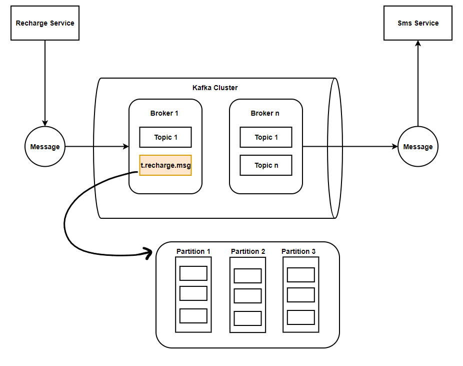

# From Zero to Hero: Implementing Kafka in Your Spring Boot Applications

Apache Kafka is a distributed streaming platform that has gained immense popularity for its ability to handle real-time data feeds. It's used by thousands of companies for various use cases, including log aggregation, stream processing, event sourcing, and more. This project aims to introduce Apache Kafka, explain its core concepts, and demonstrate its practical usage through two sample applications in the telco domain.



## What is Apache Kafka?
Apache Kafka is a high-throughput, low-latency platform for handling real-time data feeds. It is designed to provide the following capabilities:

1. **Publish and Subscribe**: Kafka allows applications to publish streams of records (messages) and subscribe to those streams.
2. **Store**: Kafka stores streams of records in a fault-tolerant manner.
3. **Process**: Kafka provides capabilities to process streams of records as they occur.

Kafka is often compared to a message queue, but it offers more advanced features and is designed for distributed, fault-tolerant environments.

## Core Concepts of Kafka

1. **Producer**: An application that publishes messages to Kafka topics.
2. **Consumer**: An application that subscribes to Kafka topics and processes the messages.
3. **Topic**: A category or feed name to which records are sent by producers. Topics are partitioned and replicated for scalability and fault-tolerance.
4. **Partition**: A single topic can have multiple partitions, allowing parallel processing of data.
5. **Broker**: A Kafka server that stores data and serves clients.
6. **Consumer Group**: A group of consumers that work together to consume messages from a topic.

## Kafka Message Brokers
**Message Broker**: A Kafka broker is a server that receives messages from producers, stores them, and serves them to consumers. Kafka clusters consist of multiple brokers to ensure scalability and fault-tolerance.

_- Example:_
  - **Producers** are like people sending letters.
  - **Kafka Broker** is the post office receiving, storing, and sorting letters.
  - **Consumers are** like people picking up their letters from the post office.

## Kafka Topics
**Topic**: A topic is a category or feed name to which records are sent by producers. Kafka topics are split into partitions for scalability.

_- Example:_
  - **Producers** put letters (messages) into a mailbox (topic).
  - **Consumers** can take letters from the mailbox.

## Kafka Partitions
**Partition**: A partition is a subset of a topic. Each topic can have multiple partitions to allow parallel processing and increase throughput. Partitions are distributed across multiple brokers.

_- Example:_
  - **Topic** is the filing cabinet labeled "Invoices".
  - **Partitions** are individual drawers within the cabinet.
  - **Producers** can place invoices in any drawer (partition).
  - **Consumers** can read from specific drawers, allowing multiple people to access the filing cabinet simultaneously.

## Kafka Architecture

- **Producers** send messages to Kafka topics.
- **Topics** are partitioned, and each partition is replicated across multiple brokers.
- **Consumers** read messages from topics, and each consumer in a group processes messages from a subset of partitions.

## Project - Use Case: Telco Domain Applications
Let's demonstrate Kafka's usage through two Spring Boot applications in the telecom domain: `recharge-service` and `message-service`.

1. recharge-service: Handles mobile recharge requests and publishes a Kafka message upon successful recharge.
2. message-service: Listens to Kafka messages from the recharge-service and sends a confirmation SMS to the customer.

```angular2html
recharge-topic
  ├── partition 0
  ├── partition 1
  └── partition 2

Kafka Cluster
├── Broker 1
│     ├── partition 0 of recharge-topic
├── Broker 2
│     ├── partition 1 of recharge-topic
└── Broker 3
├── partition 2 of recharge-topic

Message Service
├── Reads from partition 0
├── Reads from partition 1
└── Reads from partition 2
```
